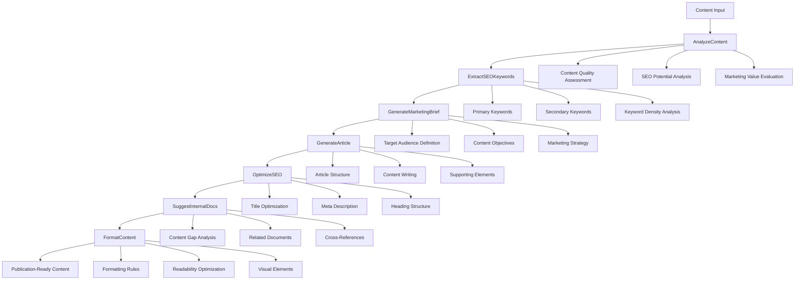

# Pipeline Architecture

## Overview

The Arthur Marketing Generator follows a comprehensive 7-step content analysis and generation pipeline designed to produce high-quality, SEO-optimized marketing content. The pipeline is built on the Any Agent framework and uses a modular plugin architecture for maximum flexibility and extensibility.

## Pipeline Workflow



## Step-by-Step Breakdown

### 1. AnalyzeContent
**Purpose**: Initial content analysis and quality assessment

**Key Functions**:
- Content quality assessment
- SEO potential analysis
- Marketing value evaluation
- Readability scoring
- Completeness checking

**Input**: Raw content (text, documents, etc.)
**Output**: Comprehensive content analysis with quality metrics

### 2. ExtractSEOKeywords
**Purpose**: Extract and analyze SEO keywords for optimization

**Key Functions**:
- Primary keyword extraction
- Secondary keyword identification
- Keyword density analysis
- LSI (Latent Semantic Indexing) keyword discovery
- Keyword scoring and ranking

**Input**: Content analysis results
**Output**: Structured keyword data with relevance scores

### 3. GenerateMarketingBrief
**Purpose**: Create comprehensive marketing brief and strategy

**Key Functions**:
- Target audience definition
- Content objective setting
- Marketing strategy creation
- Competitor analysis
- Content calendar suggestions

**Input**: Content analysis + SEO keywords
**Output**: Detailed marketing brief and strategy

### 4. GenerateArticle
**Purpose**: Generate high-quality article content

**Key Functions**:
- Article structure generation
- Content writing and optimization
- Supporting elements addition
- Quality review and improvement
- Call-to-action integration

**Input**: Marketing brief + SEO keywords
**Output**: Structured article content

### 5. OptimizeSEO
**Purpose**: Apply advanced SEO optimizations

**Key Functions**:
- Title tag optimization
- Meta description optimization
- Heading structure optimization
- Content structure analysis
- Internal linking strategy

**Input**: Generated article + SEO keywords
**Output**: SEO-optimized content

### 6. SuggestInternalDocs
**Purpose**: Suggest internal documents and cross-references

**Key Functions**:
- Content gap analysis
- Related document suggestions
- Cross-reference identification
- Content relationship mapping
- Internal linking optimization

**Input**: SEO-optimized content
**Output**: Internal documentation suggestions

### 7. FormatContent
**Purpose**: Final formatting and publication preparation

**Key Functions**:
- Consistent formatting rules
- Readability optimization
- Visual element integration
- Publication preparation
- Quality validation

**Input**: SEO-optimized content + internal docs
**Output**: Publication-ready content

## Data Flow

The pipeline uses a standardized data flow pattern:

```yaml
context_passing:
  AnalyzeContent:
    output: "content_analysis_result"
    next_input: "content_analysis_result"
    data_structure: "Dict[str, Any]"
  ExtractSEOKeywords:
    input: "content_analysis_result"
    output: "seo_keywords_result"
    next_input: "seo_keywords_result"
    data_structure: "Dict[str, Any]"
  # ... (continued for all steps)
```

## Error Handling

Each step in the pipeline includes comprehensive error handling:

- **Input Validation**: Validates input data before processing
- **Content Validation**: Ensures content meets quality standards
- **Error Logging**: Detailed logging for debugging and monitoring
- **Graceful Degradation**: Continues processing even if individual steps fail
- **Standardized Returns**: Consistent error format across all steps

## Plugin Architecture

The pipeline uses a modular plugin system where each step is implemented as a plugin:

```
src/marketing_project/plugins/
├── content_analysis/          # Step 1: Content Analysis
├── seo_keywords/              # Step 2: SEO Keywords
├── marketing_brief/           # Step 3: Marketing Brief
├── article_generation/        # Step 4: Article Generation
├── seo_optimization/          # Step 5: SEO Optimization
├── internal_docs/             # Step 6: Internal Docs
└── content_formatting/        # Step 7: Content Formatting
```

## Configuration

The pipeline is configured through `config/pipeline.yml`:

```yaml
version: "2"

pipelines:
  default:
    - AnalyzeContent
    - ExtractSEOKeywords
    - GenerateMarketingBrief
    - GenerateArticle
    - OptimizeSEO
    - SuggestInternalDocs
    - FormatContent

sub_pipelines:
  content_analysis:
    - AnalyzeContentType
    - ExtractContentMetadata
    - ValidateContentStructure
  # ... (detailed sub-pipeline steps)
```

## Benefits

1. **Comprehensive Coverage**: 7-step process ensures thorough content analysis and optimization
2. **SEO-First Approach**: SEO optimization integrated throughout the pipeline
3. **Quality Assurance**: Multiple quality checks and validation steps
4. **Marketing Integration**: Built-in marketing strategy and brief generation
5. **Scalable Architecture**: Modular plugin system for easy extension
6. **Professional Output**: Publication-ready content with proper formatting
7. **Any Agent Compatible**: Built on Any Agent framework for maximum flexibility

## Usage

The pipeline can be used by:

1. **Direct API Calls**: Call individual pipeline steps programmatically
2. **Full Pipeline**: Run the complete 7-step process
3. **Custom Workflows**: Create custom workflows using specific steps
4. **Batch Processing**: Process multiple content pieces in batch

## Monitoring and Analytics

The pipeline includes built-in monitoring capabilities:

- **Performance Metrics**: Track processing time for each step
- **Quality Scores**: Monitor content quality improvements
- **Error Rates**: Track and analyze error patterns
- **Success Rates**: Monitor overall pipeline success rates
- **Custom Metrics**: Define custom metrics for specific use cases

## Extensibility

The pipeline is designed for easy extension:

- **New Plugins**: Add new processing steps as plugins
- **Custom Functions**: Add custom functions to existing plugins
- **Configuration**: Modify pipeline behavior through configuration
- **Integration**: Integrate with external services and APIs
- **Customization**: Customize for specific business needs
